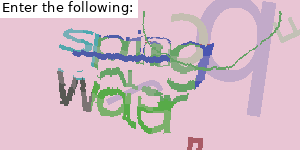

======================================
Welcome to captcha9kw's documentation!
======================================

captcha9kw is a smallish Python package for making use of the 
`9kw.eu`_ services, including solving of interactive captchas like 
Google's reCaptcha or image-based captchas used by a lot of different 
services out there.

.. important::

    This package is under construction and functionality may change.

Installation
============

You can install captcha9kw from PyPI using pip:

.. code:: shell

    $ pip install captcha9kw

Getting started
===============

Solving a simple image-based captcha is pretty easy:

    The captcha used here.

.. code-block:: python
    :caption: image-captcha

    from captcha9kw import api9kw

    conn = api9kw()
    conn.api_key = "myapikeyhere"
    print(f"Current account balance: {conn.balance} credits.")
    captcha_id = conn.submit_image_captcha("mycaptcha.gif")
    answer = conn.get_answer(captcha_id, wait=1)
    if(answer == "spring water"):
        conn.captcha_feedback_correct(captcha_id)
    else:
        conn.captcha_feedback_incorrect(captcha_id)

Similarly, for e.g. a reCaptcha:

.. code-block:: python
    :caption: interactive captcha

    from captcha9kw import api9kw

    conn = api9kw()
    conn.api_key = "myapikeyhere"
    print(f"Current account balance: {conn.balance} credits.")
    website_url = "https://www.some.web.site"
    website_key = obtain_site_key() # Supply your own code here
    captcha_id = conn.submit_interactive_captcha(website_key, website_url)
    answer = conn.get_answer(captcha_id, wait=1)
    if(test_answer_on_site(answer)):
        conn.captcha_feedback_correct(captcha_id)
    else:
        conn.captcha_feedback_incorrect(captcha_id)

For more information, check the :ref:`api-reference`.

.. toctree::
    :maxdepth: 1
    :hidden:

    api_reference
    changelog
    todo

9kw.eu
======

9kw.eu is a German captcha-solving service, providing a quick and easy 
API over HTTP GET/POST. Users can buy credits that will be deducted 
from based on the type of captcha in question and related settings. As 
a nice bonus, users can also earn credits for themselves by solving 
other people's captchas, either through the website directly or through 
their custom client.

You can sign up for their service at:|br|
https://www.9kw.eu/register.html

Or, if you really wish to grant me a couple of free credits, sign up 
using my referral link:|br|
https://www.9kw.eu/register.html?r=210326

.. note::

    Do not feel any pressure to use the referral link! I know a lot of 
    people feel iffy about such and I do not feel offended, if you 
    prefer to not add me as your referrer.

Also, maybe take a look at `their API`_.

.. _their API: https://www.9kw.eu/api.html

.. |br| raw:: html

    